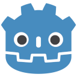
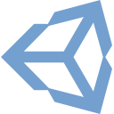
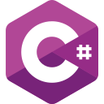
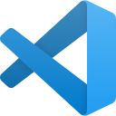
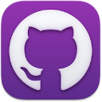
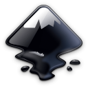
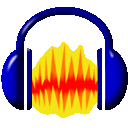

# Projects

```grid
|  |  |
|  |  |
```

# About {{FIRST_NAME}}

### Hello!

I'm a __Godot/Unity programmer__ and __technical artist__ with __<script>working = false; firstWorked = new Date('2020-12-18'); lastWorked = working ? new Date('2025-01-24') : new Date(); document.write(Math.round((lastWorked - firstWorked) / (1000 * 60 * 60 * 24 * 365.25)));</script> years of professional experience__, and over <script>gameDevStarted = 2009; document.write(new Date().getFullYear() - gameDevStarted);</script> years of personal experience before that, creating games for __PC and mobile__.

I take pride in making my code feel good in-game, and I'm always looking for ways to improve it. I have experience with a variety of systems, including [Steamworks APIs,](https://wiki.facepunch.com/steamworks/) [Unity's Input System,](https://unity.com/features/input-system) [Rewired,](https://guavaman.com/projects/rewired/) [A* Pathfinding Project,](https://arongranberg.com/astar/) and [DOTween,](http://dotween.demigiant.com) and can easily adapt to anyone's workflow.

With my experience also including __AI pathfinding, game input, animation/audio implementation, sound design, 3D modeling, shader creation, and UI design/implementation__, I can quickly put together expandable, performant prototypes and tools for other departments to get their assets implemented.

### Go-to software

```software-icons
|  |  |  |  |
|  |  |  |  |
```

### More Info

[See my __resume__ here:<br>📄 Resume](resume/)

[__Contact__ me here:<br>✉️ {{EMAIL}}](mailto:{{EMAIL}})
